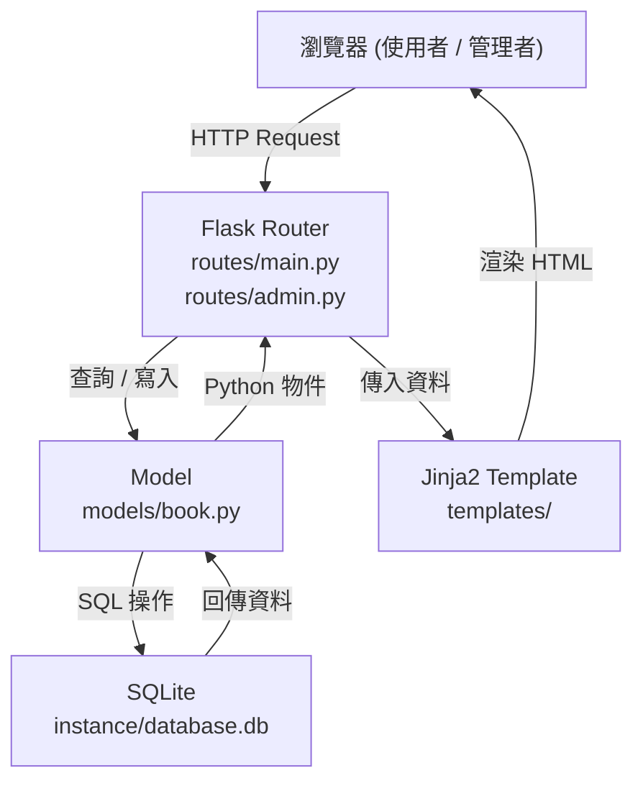
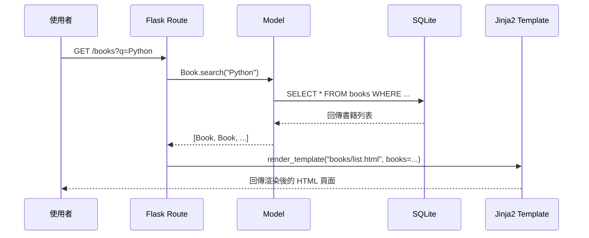
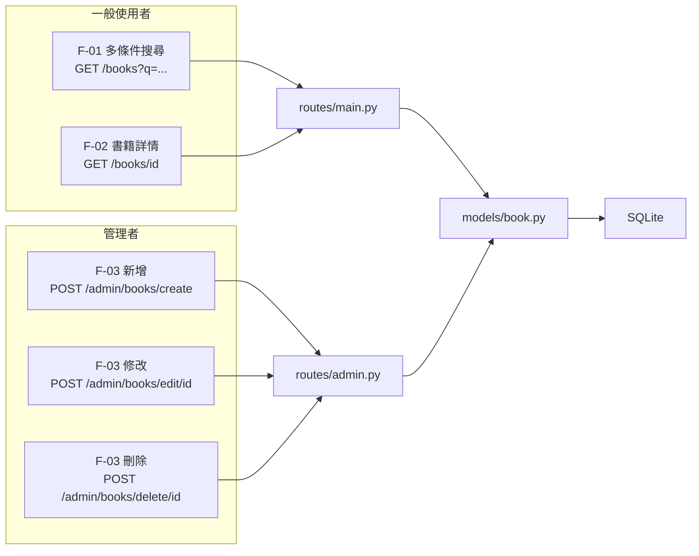

# 書籍查詢系統 — 系統架構文件 (ARCHITECTURE.md)

> 版本：1.0 | 日期：2026-05-18

---

## 一、技術架構說明

### 1.1 選用技術與原因

| 技術 | 用途 | 選用原因 |
|------|------|----------|
| **Python + Flask** | 後端 Web 框架 | 輕量、易學、適合中小型專案，路由設定簡單直覺 |
| **Jinja2** | HTML 模板引擎 | 與 Flask 深度整合，可在 HTML 中直接嵌入 Python 變數與邏輯 |
| **SQLite** | 資料庫 | 免安裝、單一檔案、適合小型系統，不需要額外資料庫伺服器 |
| **SQLAlchemy** | ORM（物件關聯對映） | 用 Python 物件操作資料庫，避免直接撰寫 SQL，降低錯誤率 |
| **CSS / JS** | 前端樣式與互動 | 原生技術，無需額外框架，保持輕量 |

---

### 1.2 Flask MVC 模式說明

本系統採用 **MVC（Model-View-Controller）** 架構：

| 角色 | 對應檔案位置 | 負責內容 |
|------|-------------|----------|
| **Model（模型）** | `app/models/` | 定義資料庫結構、負責資料存取與商業邏輯 |
| **View（視圖）** | `app/templates/` | Jinja2 HTML 模板，負責畫面顯示與呈現資料 |
| **Controller（控制器）** | `app/routes/` | Flask 路由，接收請求、呼叫 Model、回傳 View |

---

## 二、專案資料夾結構

```
group.14/
│
├── app/                        ← 主應用程式套件
│   ├── __init__.py             ← 建立 Flask app 實例，註冊 Blueprint
│   │
│   ├── models/                 ← Model 層（資料庫模型）
│   │   ├── __init__.py
│   │   └── book.py             ← Book 資料表模型（書名、作者、狀態等）
│   │
│   ├── routes/                 ← Controller 層（Flask 路由）
│   │   ├── __init__.py
│   │   ├── main.py             ← 一般使用者路由（首頁、搜尋、書籍詳情）
│   │   └── admin.py            ← 管理者路由（新增、修改、刪除書籍）
│   │
│   ├── templates/              ← View 層（Jinja2 HTML 模板）
│   │   ├── base.html           ← 共用版型（導覽列、頁尾）
│   │   ├── index.html          ← 首頁（搜尋入口）
│   │   ├── books/
│   │   │   ├── list.html       ← 書籍列表頁
│   │   │   └── detail.html     ← 書籍詳細資訊頁
│   │   └── admin/
│   │       ├── dashboard.html  ← 管理後台首頁
│   │       ├── create.html     ← 新增書籍表單
│   │       └── edit.html       ← 編輯書籍表單
│   │
│   └── static/                 ← 靜態資源
│       ├── css/
│       │   └── style.css       ← 全站樣式
│       └── js/
│           └── main.js         ← 前端互動邏輯（搜尋、篩選）
│
├── instance/
│   └── database.db             ← SQLite 資料庫檔案
│
├── docs/                       ← 文件資料夾
│   ├── PRD.md
│   └── ARCHITECTURE.md         ← 本文件
│
├── .agents/                    ← AI Agent 技能設定
├── .gitignore
└── app.py                      ← 應用程式入口（啟動 Flask）
```

---

## 三、元件關係圖

### 3.1 整體資料流



### 3.2 使用者請求流程



### 3.3 功能對應路由



---

## 四、關鍵設計決策

### 決策 1：使用 Blueprint 分離路由
- **做法**：將使用者路由（`main.py`）與管理者路由（`admin.py`）分為兩個 Flask Blueprint
- **原因**：職責分離，未來可獨立擴充，也方便加入權限驗證（只保護 admin Blueprint）

### 決策 2：管理者使用簡單 Session 密碼保護
- **做法**：在 `admin` Blueprint 加入簡單的 session 密碼驗證
- **原因**：降低初期開發複雜度，符合小型書商 / 個人藏書的使用情境

### 決策 3：搜尋採用模糊比對（LIKE）
- **做法**：使用 SQLAlchemy 的 `ilike()` 方法對書名、作者欄位進行模糊搜尋
- **原因**：使用者不一定記得完整書名，模糊比對符合 F-01 需求

### 決策 4：庫存狀態使用 Enum 欄位
- **做法**：在 `Book` 模型中設計 `status` 欄位，值為 `在庫 / 已借出 / 補貨中`
- **原因**：限制狀態選項，避免輸入錯誤值，方便用顏色標示

### 決策 5：頁面由 Flask + Jinja2 伺服器端渲染
- **做法**：不做前後端分離，直接由 Flask render HTML
- **原因**：降低架構複雜度，適合初學者理解完整請求流程
