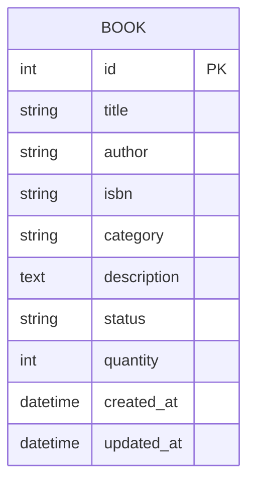

# 書籍查詢系統 — 資料庫設計文件 (DB_DESIGN.md)

> 版本：1.0 | 日期：2026-05-18

---

## 一、ER 圖（實體關係圖）



> 本系統初期為單一資料表設計，書籍（BOOK）為核心實體。
> 未來可擴充 USER 資料表（借閱紀錄）或 CATEGORY 資料表（分類管理）。

---

## 二、資料表詳細說明

### 2.1 BOOK — 書籍資料表

| 欄位名稱 | 資料型別 | 必填 | 說明 |
|----------|----------|------|------|
| `id` | INTEGER | ✅ | 主鍵，自動遞增（Primary Key） |
| `title` | TEXT | ✅ | 書名，支援模糊搜尋 |
| `author` | TEXT | ✅ | 作者姓名，支援模糊搜尋 |
| `isbn` | TEXT | ❌ | 國際書碼（ISBN），可選填 |
| `category` | TEXT | ❌ | 書籍分類（如：文學、科技、商業） |
| `description` | TEXT | ❌ | 書籍簡介，對應 F-02 詳細資訊顯示 |
| `status` | TEXT | ✅ | 庫存狀態：`在庫` / `已借出` / `補貨中` |
| `quantity` | INTEGER | ✅ | 庫存數量，預設為 1 |
| `created_at` | DATETIME | ✅ | 建立時間，自動填入 |
| `updated_at` | DATETIME | ✅ | 最後更新時間，異動時自動更新 |

---

## 三、SQL 建表語法

```sql
-- database/schema.sql

CREATE TABLE IF NOT EXISTS book (
    id          INTEGER  PRIMARY KEY AUTOINCREMENT,
    title       TEXT     NOT NULL,
    author      TEXT     NOT NULL,
    isbn        TEXT,
    category    TEXT,
    description TEXT,
    status      TEXT     NOT NULL DEFAULT '在庫'
                         CHECK(status IN ('在庫', '已借出', '補貨中')),
    quantity    INTEGER  NOT NULL DEFAULT 1,
    created_at  DATETIME NOT NULL DEFAULT (datetime('now', 'localtime')),
    updated_at  DATETIME NOT NULL DEFAULT (datetime('now', 'localtime'))
);
```

---

## 四、Python Model 程式碼

### `app/models/book.py`

```python
from datetime import datetime
from app import db  # SQLAlchemy instance from app/__init__.py


class Book(db.Model):
    """書籍資料模型"""
    __tablename__ = 'book'

    id          = db.Column(db.Integer, primary_key=True, autoincrement=True)
    title       = db.Column(db.Text, nullable=False)
    author      = db.Column(db.Text, nullable=False)
    isbn        = db.Column(db.Text, nullable=True)
    category    = db.Column(db.Text, nullable=True)
    description = db.Column(db.Text, nullable=True)
    status      = db.Column(db.Text, nullable=False, default='在庫')
    quantity    = db.Column(db.Integer, nullable=False, default=1)
    created_at  = db.Column(db.DateTime, nullable=False, default=datetime.now)
    updated_at  = db.Column(db.DateTime, nullable=False, default=datetime.now,
                            onupdate=datetime.now)

    # ──────────────────────────────────────────
    # CRUD 方法
    # ──────────────────────────────────────────

    @classmethod
    def get_all(cls):
        """取得所有書籍"""
        return cls.query.order_by(cls.created_at.desc()).all()

    @classmethod
    def get_by_id(cls, book_id):
        """依 ID 取得單筆書籍"""
        return cls.query.get_or_404(book_id)

    @classmethod
    def search(cls, keyword):
        """模糊搜尋書名或作者（對應 F-01）"""
        pattern = f'%{keyword}%'
        return cls.query.filter(
            db.or_(
                cls.title.ilike(pattern),
                cls.author.ilike(pattern)
            )
        ).all()

    @classmethod
    def create(cls, title, author, isbn=None, category=None,
               description=None, status='在庫', quantity=1):
        """新增書籍（對應 F-03）"""
        book = cls(
            title=title,
            author=author,
            isbn=isbn,
            category=category,
            description=description,
            status=status,
            quantity=quantity
        )
        db.session.add(book)
        db.session.commit()
        return book

    def update(self, **kwargs):
        """修改書籍資料（對應 F-03）"""
        for key, value in kwargs.items():
            if hasattr(self, key):
                setattr(self, key, value)
        self.updated_at = datetime.now()
        db.session.commit()
        return self

    def delete(self):
        """刪除書籍（對應 F-03）"""
        db.session.delete(self)
        db.session.commit()

    def __repr__(self):
        return f'<Book id={self.id} title={self.title} status={self.status}>'
```
