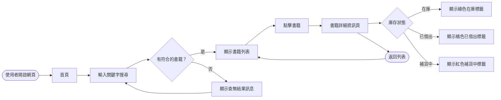
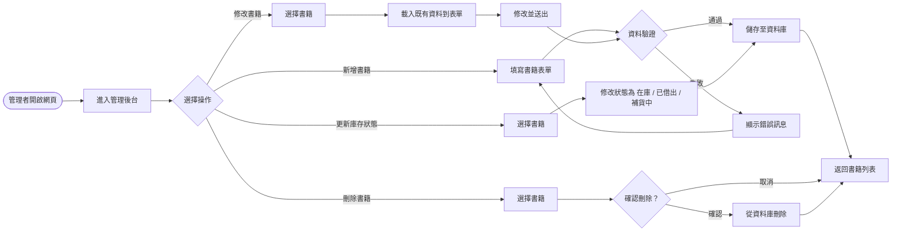
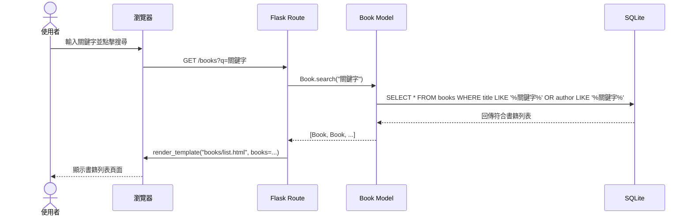
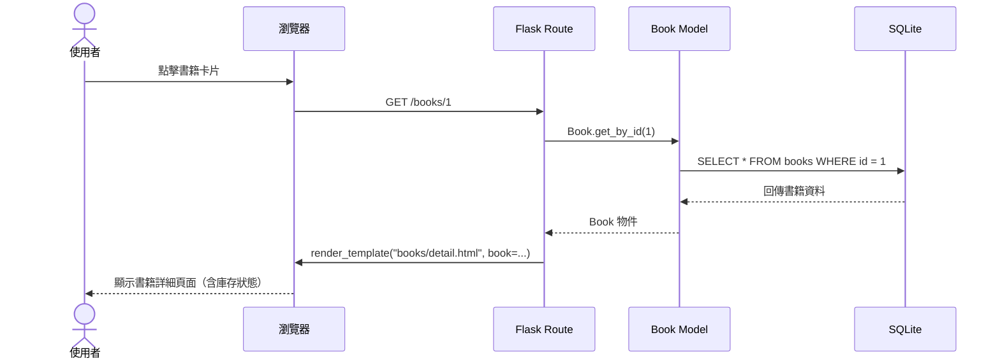
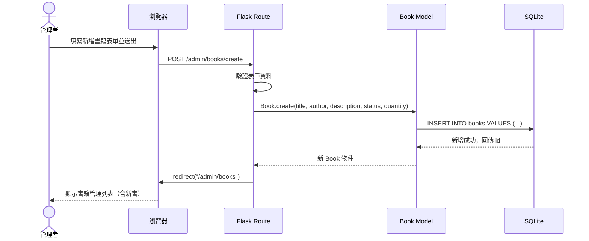
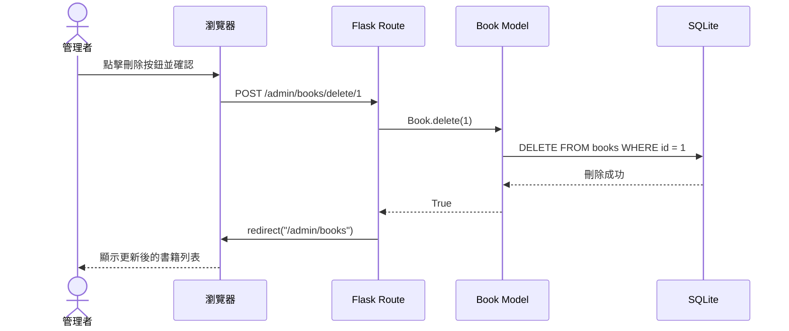

# 書籍查詢系統 — 流程圖文件 (FLOWCHART.md)

> 版本：1.0 | 日期：2026-05-18

---

## 一、使用者流程圖（User Flow）

### 1.1 一般使用者流程

### 1.2 管理者流程

---

## 二、系統序列圖（Sequence Diagram）

### 2.1 使用者搜尋書籍

### 2.2 使用者查看書籍詳情

### 2.3 管理者新增書籍

### 2.4 管理者刪除書籍

---

## 三、功能清單對照表

| 功能編號 | 功能名稱 | HTTP 方法 | URL 路徑 | 對應模板 |
|----------|----------|-----------|----------|----------|
| F-01 | 多條件書籍搜尋 | GET | `/books?q=關鍵字` | `books/list.html` |
| F-02 | 書籍詳細資訊與狀態顯示 | GET | `/books/<id>` | `books/detail.html` |
| F-03a | 新增書籍（表單頁） | GET | `/admin/books/create` | `admin/create.html` |
| F-03b | 新增書籍（送出） | POST | `/admin/books/create` | redirect → 列表 |
| F-03c | 修改書籍（表單頁） | GET | `/admin/books/edit/<id>` | `admin/edit.html` |
| F-03d | 修改書籍（送出） | POST | `/admin/books/edit/<id>` | redirect → 列表 |
| F-03e | 刪除書籍 | POST | `/admin/books/delete/<id>` | redirect → 列表 |
| —      | 管理後台首頁 | GET | `/admin` | `admin/dashboard.html` |
| —      | 網站首頁 | GET | `/` | `index.html` |
